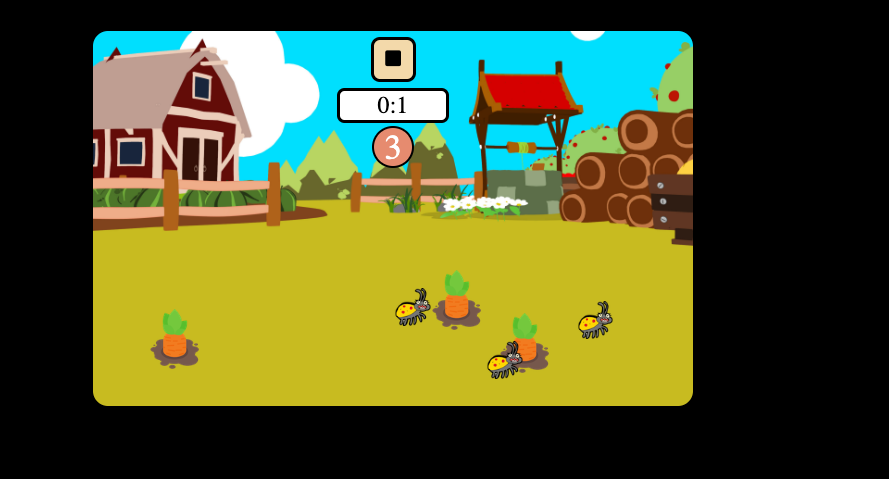
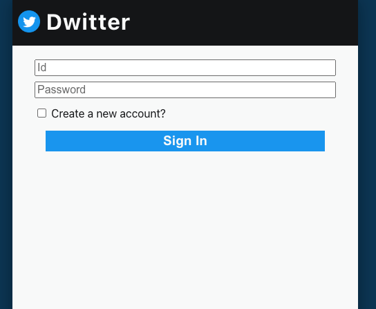
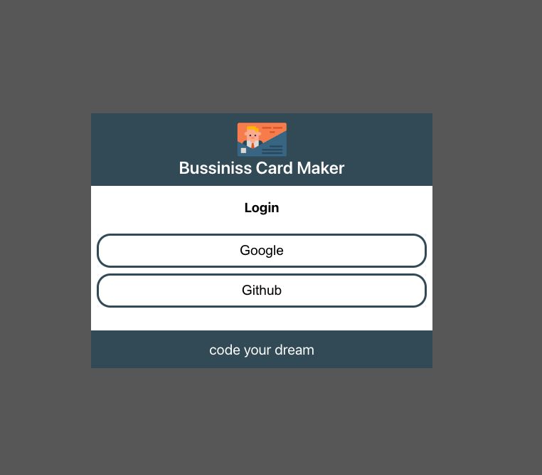
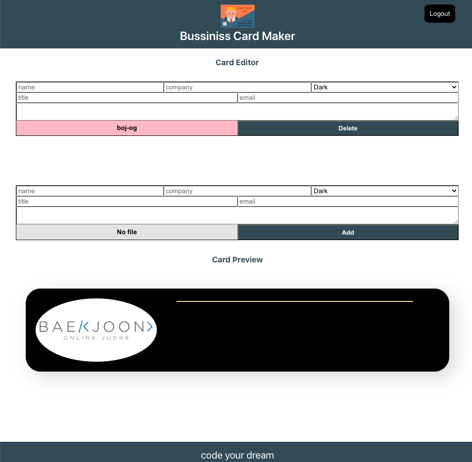
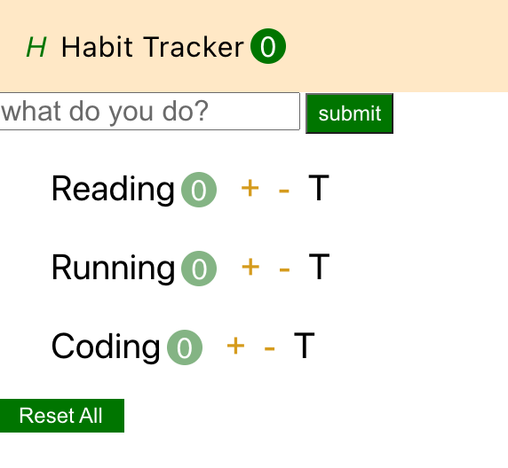
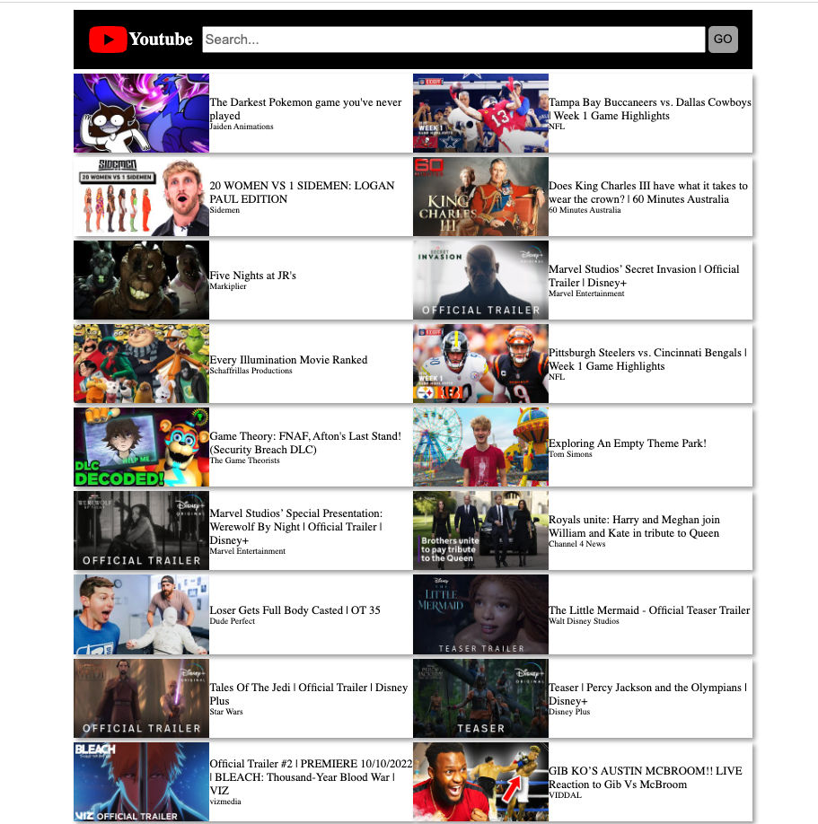
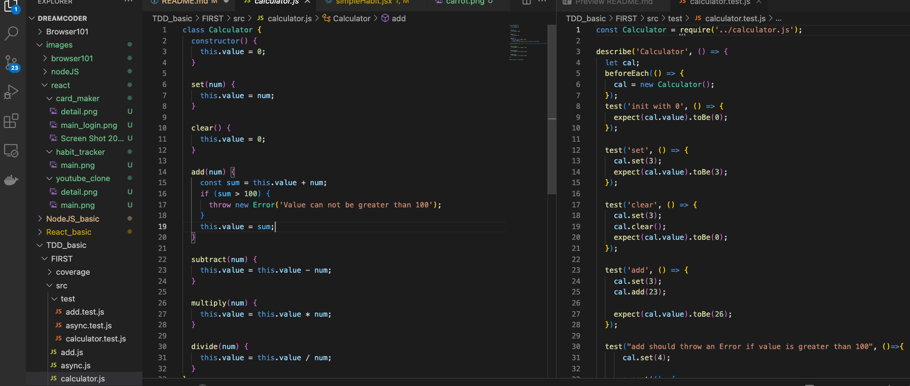
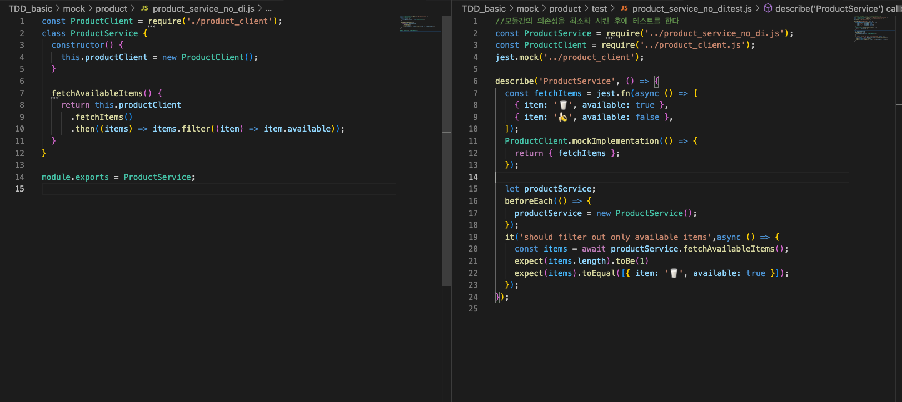

## Browser 101

### carrot 게임 만들기

> 실행방법 1. npm install 2. npm run start

- start 버튼을 누르면 시간 재생
- 벌레와 당근의 위치는 랜덤으로 배치
- 당근을 모두 누르면 성공
- 시간 내에 당근을 모두 누르지 못하거나, 벌레를 누르면, 실패

#### 배운내용

- WEB APIS
- DOM
- Render Trees
- Events
- Event loop

## NodeJS

> 실행방법 server 폴더, client 폴더 각각 진행 1. npm install 2. npm run start

- jsonwebtoken 방식을 이용해 회원가입 및 로그인
- twitter 게시물 남기고 수정 및 삭제(CRUD)기능 구현

#### 배운내용

- Node Modules
- NPM
- Web 기초 지식 HTTP
- Node로 서버 만들기
- Restful APIs
- Express.js
- MVC 패턴
- mongoDB
- Deployment

## React

### card_maker

- firebase를 통한 SSO 로그인
- firebase에 이미지를 올리고, 내려받는 기능 구현
- 프리뷰 기능 구현

### habit-tracker

- todo-list 구체화

### youtube_clone

- react에서 API로 동영상을 받아와서 재생
- 반응형 CSS로 CSS 구성

## TDD 방식의 개발 경험

- unit 테스트부터 E2E 테스트까지의 경험

## Typescript 내용 정리

[typescript github 바로가기]("https://github.com/in-woong/Dreamcoder/tree/main/Typescript_basic")
